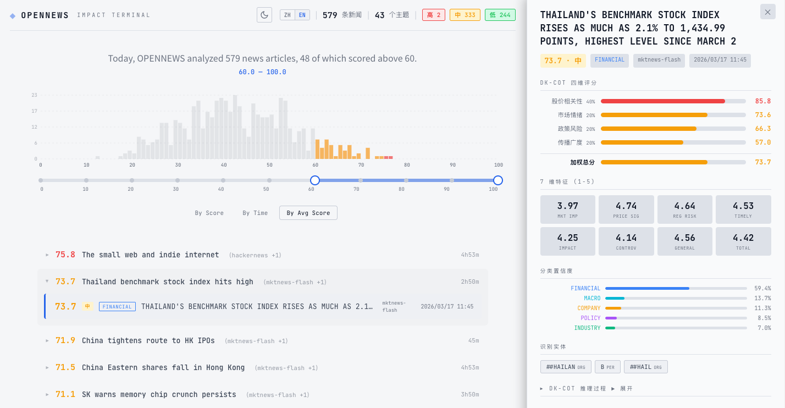

<div align="center">

# OpenNews

实时金融新闻知识图谱与影响评估系统

[](https://www.python.org/downloads/)
[](LICENSE)
[](README.en.md)

</div>

---

<p align="center">
  
</p>

## 概述

OpenNews 是一个基于 LangGraph 编排的金融新闻处理流水线。自动抓取多平台新闻，完成 NER 实体抽取、主题聚类、零样本分类、7 维特征提取、时序记忆聚合、DK-CoT 影响评分，并将结果写入 Neo4j 知识图谱和 PostgreSQL 数据库。内置 Web 面板支持实时浏览、筛选和查看详情。

### 流水线 DAG

```
重试标签翻译 → 抓取新闻 → 嵌入 → 实体抽取 ─┬→ 主题聚类 ──────┐
                                             ├→ 零样本分类 ────┤
                                             └→ 特征提取 ──────┘
                                                     ↓
                                               构建载荷 → 输出文件
                                                     ↓
                                               记忆写入 → 趋势更新
                                                     ↓
                                                 报告生成 → 图谱写入 → END
```

### 核心能力

- 多源抓取 — NewsNow API、RSS、JSONL 种子文件
- FinBERT 嵌入 (768 维) + 层次余弦阈值聚类
- DeBERTa-v3 零样本分类（金融市场 / 政策法规 / 公司事件 / 宏观经济 / 行业趋势）
- 7 维新闻价值评分（市场影响、价格信号、监管风险、时效性、影响力、争议性、可推广性）
- Redis 30 天滚动时序记忆 + 每日情绪聚合
- DK-CoT 四维影响评分：股价相关性 (40%)、市场情绪 (20%)、政策风险 (20%)、传播广度 (20%)
- LLM 主题精炼 + 中英双语标签（本地化失败自动重试）
- Neo4j 知识图谱（News / Entity / Topic 节点 + MENTIONS / IN_TOPIC / IMPACTS 关系）
- PostgreSQL 批次持久化 + URL 去重
- 实时 Web 面板：分数分布图、双端滑块筛选、详情侧边栏

## 依赖服务

| 服务 | 用途 | 必需 | 默认地址 |
|------|------|------|----------|
| PostgreSQL 16+ | 主存储 | 是 | 仅容器内网 |
| Neo4j 5+ | 知识图谱 | 否（不可用时跳过） | 仅容器内网 |
| Redis 7+ | 时序记忆 | 否（不可用时回退到内存） | 仅容器内网 |

仅 Web 面板端口（默认 `8080`）对宿主机暴露，所有基础设施服务通过 Docker 内部网络通信。

### Docker 快速启动

后端容器以离线模式从宿主机的 HuggingFace 缓存（`~/.cache/huggingface`）加载 NLP 模型。首次使用前需在宿主机上下载模型：

```bash
# 在宿主机上下载模型（一次性，约 1.5 GB）
pip install sentence-transformers transformers
python -c "
from sentence_transformers import SentenceTransformer
from transformers import pipeline, AutoTokenizer, AutoModelForSequenceClassification
SentenceTransformer('ProsusAI/finbert')
pipeline('ner', model='dslim/bert-base-NER')
AutoTokenizer.from_pretrained('MoritzLaurer/DeBERTa-v3-base-mnli-fever-anli')
AutoModelForSequenceClassification.from_pretrained('MoritzLaurer/DeBERTa-v3-base-mnli-fever-anli')
"

# 启动全部服务
docker compose -f docker/docker-compose.yml up -d

# 查看状态
docker compose -f docker/docker-compose.yml ps
```

如果 HuggingFace 缓存在非默认路径，通过 `HF_HOME` 指定：

```bash
HF_HOME=/path/to/your/cache docker compose -f docker/docker-compose.yml up -d
```

所有数据持久化到 `docker/` 下的本地目录（postgres、neo4j、redis）。`seeds/` 和 `config/` 目录挂载到后端容器中，在宿主机上编辑即可生效。

数据卷映射：

| 服务 | 宿主机路径 | 容器路径 |
|------|-----------|----------|
| PostgreSQL | `docker/postgres/` | `/var/lib/postgresql/data` |
| Neo4j | `docker/neo4j/data/`、`docker/neo4j/logs/` | `/data`、`/logs` |
| Redis | `docker/redis/` | `/data` |
| 后端配置 | `config/` | `/app/config` |
| 种子新闻 | `seeds/` | `/app/seeds` |

Web 面板：http://localhost:8080（可通过 `WEB_PORT` 修改端口）

## 安装

```bash
git clone https://github.com/user/opennews.git && cd opennews

python3.10 -m venv .venv
source .venv/bin/activate

pip install -r requirements.txt
```

首次运行时自动下载以下 HuggingFace 模型（共约 1.5 GB）：

| 模型 | 用途 | 大小 |
|------|------|------|
| `ProsusAI/finbert` | 金融文本嵌入 + BERTopic | ~440 MB |
| `dslim/bert-base-NER` | 命名实体识别 | ~430 MB |
| `MoritzLaurer/DeBERTa-v3-base-mnli-fever-anli` | 零样本分类 + 特征提取 | ~440 MB |

## 使用

### Docker（推荐）

```bash
# 启动全部服务
docker compose -f docker/docker-compose.yml up -d

# 查看日志
docker compose -f docker/docker-compose.yml logs -f backend

# 停止
docker compose -f docker/docker-compose.yml down
```

### 本地开发

本地开发时需要基础设施端口暴露到宿主机，可手动启动：

```bash
# 手动启动基础设施（暴露端口）
docker run -d --name opennews-pg -p 5432:5432 -e POSTGRES_PASSWORD=123456 -e POSTGRES_DB=opennews postgres:16-alpine
docker run -d --name opennews-neo4j -p 7474:7474 -p 7687:7687 -e NEO4J_AUTH=neo4j/Aa123456 neo4j:5-community
docker run -d --name opennews-redis -p 6379:6379 redis:7-alpine

# 启动流水线
PYTHONPATH=src python -m opennews.main

# 构建前端（另开终端）
cd web && npm install && npx vite build && cd ..

# 启动 Web 面板
PYTHONPATH=src python web/server.py --port 8080
```

浏览器打开 http://localhost:8080 查看结果。

### 一键启动（传统方式）

```bash
./build.sh
```

### 清除数据

```bash
./db-clean.sh
```

## 配置

所有配置均可通过环境变量覆盖。

| 环境变量 | 说明 | 默认值 |
|----------|------|--------|
| `NEWS_POLL_INTERVAL_MIN` | 轮询间隔（分钟） | `5` |
| `BATCH_SIZE` | 每轮最大抓取条数 | `32` |
| `EMBEDDING_MODEL` | 嵌入模型 | `ProsusAI/finbert` |
| `NER_MODEL` | NER 模型 | `dslim/bert-base-NER` |
| `NEO4J_URI` | Neo4j 连接地址 | `bolt://neo4j:7687` (Docker) / `bolt://127.0.0.1:7687` (本地) |
| `NEO4J_USER` / `NEO4J_PASSWORD` | Neo4j 凭据 | `neo4j` / `Aa123456` |
| `CLASSIFIER_MODEL` | 零样本分类模型 | `MoritzLaurer/DeBERTa-v3-base-mnli-fever-anli` |
| `REDIS_URL` | Redis 连接地址 | `redis://redis:6379/0` (Docker) / `redis://127.0.0.1:6379/0` (本地) |
| `MEMORY_WINDOW_DAYS` | 时序记忆窗口（天） | `30` |
| `PG_HOST` / `PG_PORT` / `PG_USER` / `PG_PASSWORD` / `PG_DATABASE` | PostgreSQL | `127.0.0.1` / `5432` / `postgres` / `123456` / `opennews` |
| `REPORT_ENABLED` | 是否生成影响评估报告 | `true` |
| `REPORT_WEIGHT_STOCK` | 股价相关性权重 | `0.40` |
| `REPORT_WEIGHT_SENTIMENT` | 市场情绪权重 | `0.20` |
| `REPORT_WEIGHT_POLICY` | 政策风险权重 | `0.20` |
| `REPORT_WEIGHT_SPREAD` | 传播广度权重 | `0.20` |
| `LLM_API_KEY` | LLM API 密钥（主题精炼） | — |
| `LLM_BASE_URL` | LLM 端点（OpenAI 兼容） | — |
| `LLM_MODEL` | LLM 模型名称 | `gpt-4o-mini` |

额外配置文件：
- `config/sources.yaml` — 新闻源端点和频道
- `config/llm.yaml` — LLM 提供商设置和主题精炼提示词

## 新闻输入

### NewsNow API（默认）

在 `config/sources.yaml` 中配置端点：

```yaml
newsnow:
  - url: https://newsnow.busiyi.world/api/s/entire
    sources:
      - wallstreetcn-news
      - cls-telegraph
      - 36kr-quick
```

### 种子文件（手动 / 批量）

将新闻写入 `seeds/realtime_seeds.jsonl`，每行一个 JSON 对象：

```jsonl
{"news_id":"seed-001","title":"美联储暗示放缓降息","content":"官员们在通胀粘性背景下发出谨慎信号。","source":"seed","url":"seed://seed-001","published_at":"2026-03-09T07:30:00+00:00"}
```

| 字段 | 类型 | 必需 | 说明 |
|------|------|------|------|
| `news_id` | string | 是 | 唯一标识 |
| `title` | string | 是 | 新闻标题 |
| `content` | string | 否 | 正文（缺省使用标题） |
| `source` | string | 否 | 来源标识（默认 `"seed"`） |
| `url` | string | 否 | 原文链接 |
| `published_at` | string | 否 | ISO 8601 时间戳（默认当前时间） |

## 输出数据

### PostgreSQL（主存储）

通过 Web API 或直接 SQL 查询：

```sql
-- 最近的高影响新闻
SELECT payload->>'news'->>'title', payload->'report'->>'final_score'
FROM batch_records br JOIN batches b ON br.batch_id = b.batch_id
WHERE (payload->'report'->>'impact_level') = '高'
ORDER BY b.created_at DESC;
```

### Web API

| 端点 | 说明 |
|------|------|
| `GET /api/batches` | 列出所有批次 |
| `GET /api/batches/latest` | 最新批次记录 |
| `GET /api/batches/<id>` | 指定批次记录 |
| `GET /api/records?hours=N` | 最近 N 小时的记录 |

### Neo4j 知识图谱

通过 Neo4j Browser 查询（需本地开发模式暴露 `7474` 端口，见[本地开发](#本地开发)）：

```cypher
-- 高影响新闻
MATCH (n:News) WHERE n.impact_level = '高'
RETURN n.title, n.final_impact_score ORDER BY n.final_impact_score DESC

-- 主题趋势
MATCH (t:Topic) WHERE t.trend_direction IS NOT NULL
RETURN t.label, t.trend_direction, t.avg_impact ORDER BY t.avg_impact DESC

-- 实体关系网络
MATCH (e1:Entity)-[r:IMPACTS]->(e2:Entity)
RETURN e1.name, e2.name, r.weight ORDER BY r.weight DESC LIMIT 20
```

## 项目结构

```
opennews/
├── src/opennews/
│   ├── main.py                        # 入口
│   ├── config.py                      # 全局配置
│   ├── db.py                          # PostgreSQL 持久化
│   ├── agents/
│   │   ├── classifier_agent.py        # DeBERTa 零样本分类
│   │   ├── feature_agent.py           # 7 维特征提取
│   │   ├── memory_agent.py            # 时序聚合
│   │   ├── report_agent.py            # DK-CoT 影响评分
│   │   └── topic_refine_agent.py      # LLM 主题精炼
│   ├── graph/
│   │   ├── neo4j_client.py            # Neo4j 连接 & 写入
│   │   ├── upsert.py                  # GraphPayload 构建
│   │   └── subgraph_query.py          # 子图查询 & 社区检测
│   ├── ingest/
│   │   ├── news_fetcher.py            # 多平台并行抓取
│   │   ├── sources.py                 # 新闻源配置加载
│   │   ├── checkpoint.py              # 增量检查点
│   │   └── seed_injector.py           # JSONL 种子注入
│   ├── llm/
│   │   └── client.py                  # OpenAI 兼容 LLM 客户端
│   ├── memory/
│   │   └── __init__.py                # Redis 时序存储
│   ├── nlp/
│   │   ├── embedder.py                # FinBERT 嵌入
│   │   └── entity_extractor.py        # NER 实体抽取
│   ├── topic/
│   │   └── online_topic_model.py      # 层次余弦聚类
│   ├── scheduler/
│   │   └── polling_job.py             # APScheduler 定时轮询
│   └── workflow/
│       └── langgraph_pipeline.py      # LangGraph DAG
├── web/
│   ├── server.py                      # Web 服务器（API + 静态文件）
│   ├── index.html / style.css / app.js
├── config/
│   ├── llm.yaml                       # LLM 配置
│   └── sources.yaml                   # 新闻源配置
├── docker/
│   └── docker-compose.yml             # 全栈编排：PG + Neo4j + Redis + 后端 + 前端
├── Dockerfile                         # 后端 & 前端镜像
├── seeds/
│   └── realtime_seeds.jsonl           # 种子新闻
├── build.sh                           # 一键启动脚本
├── db-clean.sh                        # 数据清理脚本
└── requirements.txt
```

## 许可证

MIT
